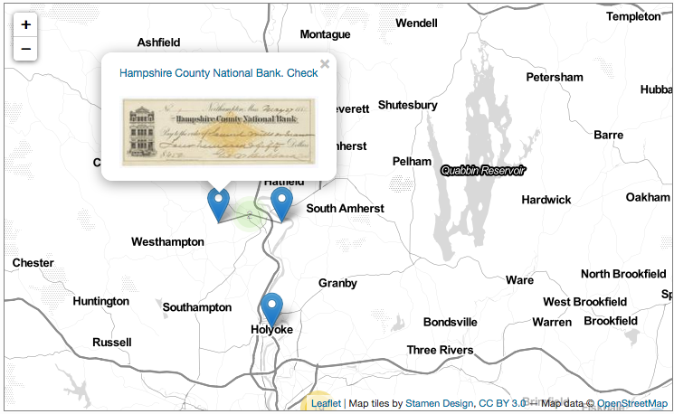

# Biggert Static Site
Jekyll Site Repo for the Biggert Collection of Architectural Vignettes @ the Avery Architectural and Fine Arts Library



## Getting Started

### Set up

```sh
$ git clone https://github.com/cul/biggert_static.git && cd biggert_static
$ bundle
```

## Add/update data (if needed)

#### Generate json from hyacinth csv
```sh
$ ruby _lib/export.rb > _data/biggert-items.json
```

#### Run the Rake processing tasks

Generate the collection markdown pages:<br>
`$ bundle exec rake wax:pagemaster biggert`

Generate json for the map markers:<br>`$ bundle exec rake markers`

Generate the elasticlunr index:<br>`$ bundle exec rake wax:lunr`

__OR:__<br><br>
Run all of the above at once!<br>`$ bundle exec rake aota` (generates iiif collection, md pages, map markers & search index)


## Constant Data
| **key** 	| **value** 	|
|------------------	|------------------------------------------------------------------------	|
| `collection` 	| Biggert Collection of Architectural Vignettes on Commercial Stationery 	|
| `location` 	| Avery Architectural & Fine Arts Library, Columbia University 	|
| `sublocation` 	| Avery Classics Collection 	|
| `collector` 	| Biggert, Robert 	|
| `digital_origin` 	| reformatted digital 	|
